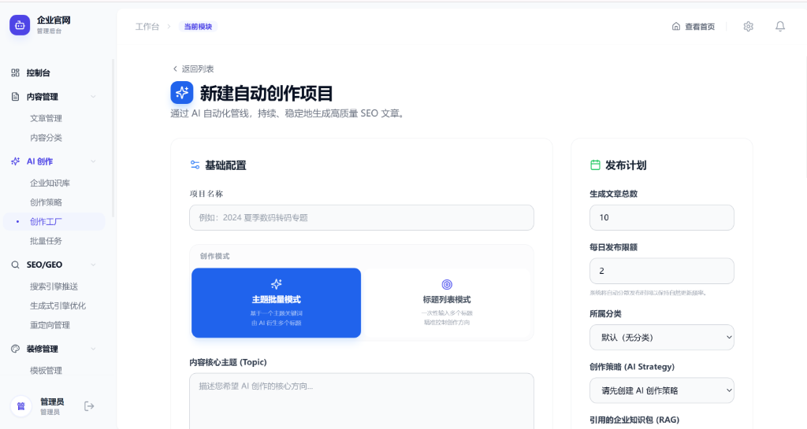

# Molicms - 智算内容管理系统 (Community Edition)

<p align="center">
  <a href="https://gitee.com/yang1-tao22222/moligeocms">
    
  </a>
  <a href="https://github.com/cdeduqb/geo">
    
  </a>
  
  
  
</p>

---

## 🖥️ 系统预览



---

## 🚀 什么是 Molicms？

**Molicms** 是一款专为 AI 时代设计的**高性能智算内容管理系统（CMS）**。它不仅涵盖了传统企业官网与门户建站的全部基础功能，更前瞻性地深度集成了 **GEO（生成式引擎优化）** 与 **AI 内容生产工厂**。

在传统的百度/谷歌关键词搜索逐渐向 ChatGPT、DeepSeek、Perplexity、豆包等 AI 问答迁移的浪潮下，Molicms 能够帮助企业构建**“能被 AI 优先理解、优先信任、优先引用并推荐”**的数字化资产。

---

## ✨ 核心特性

### 1. 基础版开源功能（完全免费）
* 📦 **内容管理系统**：完美的栏目分类、文章发布、富文本编辑器与草稿箱。
* 🎨 **响应式 UI 模板**：针对电脑/手机/平板深度优化的企业官网响应式模板，开箱即用。
* ⚙️ **系统配置中心**：网站基本信息、SEO 关键字、ICP 备案号、脚本注入及基础安全控制。
* 💎 **GEO (Generative Engine Optimization) 优化**：
  * **AI 爬虫精准管控**：内置 25+ 类主流 AI 爬虫（如 OpenAI, ByteDance, Google 等）识别与映射，一键控制抓取权限。
  * **llms.txt 规范支持**：自动为 LLMs 生成精简高密度的 Markdown 概览文件，极大提高 AI 搜索引用您的几率。
  * **动态 Schema 结构化数据**：自动生成 Schema.org JSON-LD 标签，方便 AI 大模型精准阅读和解析。
* 🤖 **AI 创作策略中心**：支持创建和编辑 AI 写作与图片 Prompt 模板，自定义 Temperature 生成创造性参数，规范文章的生成质量和风格。
* ⚡ **极速体验**：基于 Next.js 14 App Router 开发，提供极快的首屏加载与极佳的交互性能。

### 2. 商业授权高级功能（需要购买授权码激活解锁）
> 💡 系统核心商业逻辑，激活授权码后将解锁以下三大高级智算模块：
* 🤖 **AI 自动化生产工厂**：
  * **多模式批量任务自动创作**：支持根据关键词列表或标题列表，千篇级批量自动撰写高质量 SEO/GEO 深度文章。
  * **定时自动发布（Cron）**：配置定时执行，实现系统 24/7 不间断全自动内容运营与发布更新。
  * **智能去水印与配图**：AI 自动搜索和过滤配图，自动完成防侵权去水印处理，保障视觉安全。
* 🌍 **全球多语言引擎**：
  * **原生多语言路由**：基于 Next.js 国际化规范开发，支持中/英等多语言原生路由自动映射。
  * **GEO 级本地化翻译**：结合大语言模型针对目标语境文化自动优化翻译细节，非常适合外贸和出海企业。
* 🔒 **自定义版权与品牌**：
  * **去版权与自定义品牌**：支持完全自定义网站后台 Logo、版权声明、管理端主题色等，打造您个人的专属品牌产品。
  * **自定义域名绑定**：支持灵活的多域名绑定与个性化解析。

---

## 🛠️ 技术栈

* **核心框架**: Next.js 14+ (React 18), TypeScript
* **样式体系**: Tailwind CSS, Lucide Icons, Shadcn UI
* **数据库/ORM**: SQLite / MySQL, Prisma ORM
* **部署守护**: Docker Compose, PM2, Nginx Standalone

---

## ⚡ 快速开始

### 1. 克隆项目
```bash
# Gitee
git clone https://gitee.com/yang1-tao22222/moligeocms.git

# 或者 GitHub
git clone https://github.com/cdeduqb/geo.git

cd geocms
```

### 2. 准备环境变量
将项目根目录下的 `.env`（或 `env.example`）配置文件补充完整，主要包含数据库连接、接口秘钥等：
```bash
cp env.example .env
```

### 3. 安装依赖与启动
```bash
# 安装依赖
npm install

# 初始化数据库并运行迁移
npx prisma db push

# 开发模式运行
npm run dev
```
打开浏览器访问 [http://localhost:3000](http://localhost:3000) 即可。

---

## 🔒 商业授权说明

Molicms 采用 **Open-Core（开源内核）** 商业模式：
1. 基础功能完全开源，遵循 **MIT 开源协议**，任何人均可免费部署商用。
2. 涉及 **AI 自动化生产工厂**、**全球多语言引擎**、**自定义版权（品牌及域名配置）** 三大商业高级模块，需要在后台的【授权管理】中配置有效的**商业激活码**解锁使用。
3. 欢迎前往 [Molicms 官方网站 (moli123.com)](https://moli123.com/) 购买商业授权码、体验在线演示或查阅开发文档。

---

## 📞 联系我们与技术支持

如果您在安装、部署或使用过程中遇到任何问题，欢迎通过以下方式与我们取得联系：

* **官方网站**：[moli123.com](https://moli123.com/)
* **官方邮箱**：`support@moli123.com`
* **微信咨询**：`[请在此处替换为您的微信号]` （可添加客服微信，备注“Molicms 咨询”）

> 💡 **微信交流群 / 二维码**：
> 您可以把微信二维码图片重命名为 `wechat-qr.png` 并放入项目的 `public/` 目录下，我会为您排版为带二维码的可视化引导板块。

---

## 🤝 贡献与交流

如果您在使用中遇到任何问题，欢迎在 Gitee / GitHub 提交 **Issue** 或 **Pull Request**！

*让您的企业在 AI 搜索时代赢得先机！*
